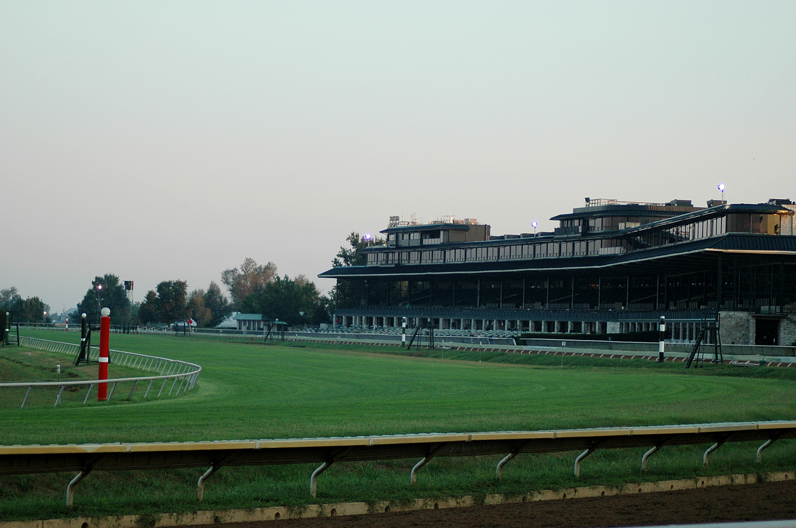

# KeenelandRaceTrack
Keeneland Race Course

https://en.wikipedia.org/wiki/Keeneland#/media/File:Keeneland_Race_Course.jpg

# 1. Maps

Map #1

Here is my animation giving a view of both the race track itself and the routes that most races I competed in. 

Map #2

A MapBox containing contuors ranging from 910' to 960'. Not quite as much terrain undulation as the Gorge.

Map #3

Here is a slideshow I prepared featuring some interesting experiences I have had at Keeneland. Some history I have had at the course, as well as a point cloud of the running course.

# 2. Area of Choice

My area of choice is the famous Keeneland Race Track in Lexington, KY, just outside downtown. Opened since 1936, it is one of the most famous race tracks in the country, and a special place in the city to me. Some of these maps will have info on how special it is.

https://www.visitlex.com/listing/keeneland-racecourse/5905/

# 3. Goals

My goals for this project was to uncover the beauty that is Keeneland, and get a visualization through technical GIS techniques. While also hoping to give a presentation on the importance of this site.

# 4. Tools and Sources

Tools used include Esri ArcGIS Pro GIS software, Cesium Ion, MapBox, Shadow Tech Cloud Computing, Github

Me competing in the 2018 Run for Recovery 5k, which has been hosted by Keeneland for over 30 years
